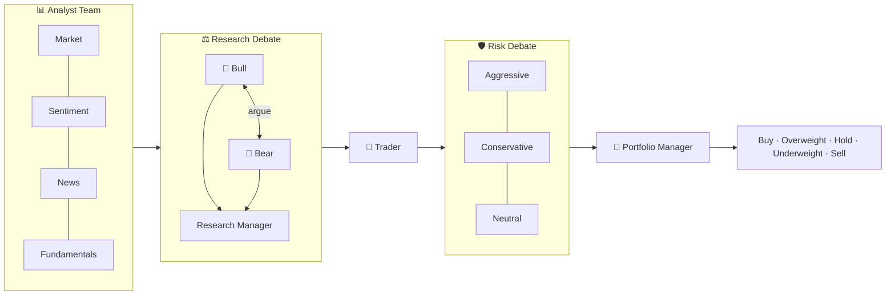
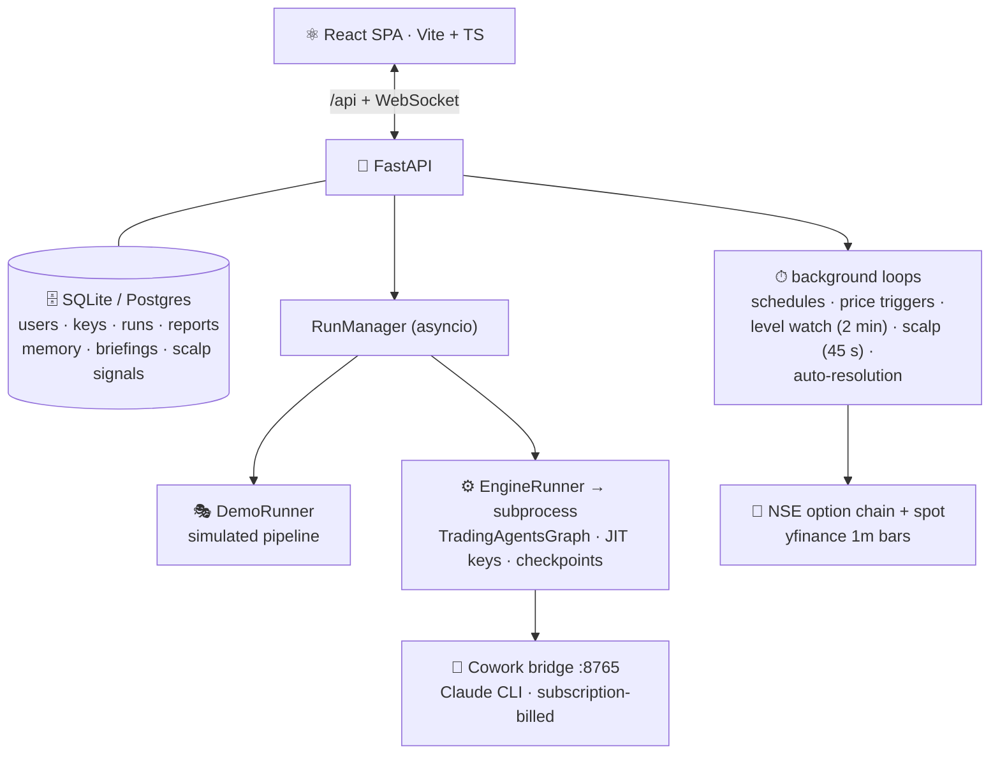

<div align="center">

# 🤖 AgentAlgo

### A 12-agent AI trading desk in your browser — built for Indian F&O

*Analysts debate. Researchers argue bull vs bear. A risk team stress-tests. A portfolio manager decides.
You get one simple Trade Card: **what to buy, entry, stop loss, target, and how many lots.***

[](backend/tests)
[](backend)
[](frontend)
[-8A2BE2)](https://github.com/TauricResearch/TradingAgents)
[](#-free-engine-runs--the-cowork-bridge)

> ⚠️ **Research tool only — not financial, investment, or trading advice. It never places broker orders.**

</div>

---

## 📖 Table of contents

- [Why AgentAlgo?](#-why-agentalgo)
- [The agent pipeline](#-the-agent-pipeline)
- [🇮🇳 F&O Desk — the flagship](#-fo-desk--the-flagship)
- [⚡ Scalp Mode](#-scalp-mode)
- [A day in the live market](#-a-day-in-the-live-market)
- [Everything else in the box](#-everything-else-in-the-box)
- [Free engine runs — the Cowork bridge](#-free-engine-runs--the-cowork-bridge)
- [Quick start](#-quick-start)
- [Architecture](#-architecture)

---

## 🎯 Why AgentAlgo?

One prompt to one LLM gives you one opinion. AgentAlgo runs the full
[TradingAgents](https://github.com/TauricResearch/TradingAgents) research pipeline — **12 specialized
agents that disagree with each other on purpose** — then distills the argument into a single,
honest verdict with exact risk numbers.

| You ask | You get |
|---|---|
| *"Should I trade NIFTY tomorrow?"* | A **Trade Card**: `TRADE` / `NO TRADE NOW`, the exact option premium to buy, entry, stop loss, two targets, risk:reward, **and position size in lots with max loss & profit in ₹** |
| *"What if the market turns mid-day?"* | Automatic re-analysis on a ±0.75% move + live **Level Watch** alerts every 2 minutes |
| *"Is this thing actually any good?"* | A **Decision Log** that grades every call against realized returns — and a **Desk Review** that grades each *agent* |

---

## 🧠 The agent pipeline



Every verdict lands in one of **five tiers** — and every completed run writes a briefing-book entry
that the *next* run on that instrument reads, so the desk remembers what it said yesterday.

---

## 🇮🇳 F&O Desk — the flagship

Full derivatives intelligence for **NIFTY · BANKNIFTY · FINNIFTY + any NSE F&O stock**:

- 📡 **Live NSE option chain** — PCR, max pain, OI walls (support/resistance), India VIX, IV skew
- 🧮 **Computed Greeks** — Black-Scholes delta, theta/day, vega for the ATM ladder (NSE gives IV; we do the math)
- 🎯 **Delta-targeted strike selection** — the pipeline picks the premium with the right delta, not a random OTM lottery ticket

### 🎴 The Trade Card

Every F&O run ends in **one table** — no digging through five reports:

| WHEN | BUY | ENTRY | STOP LOSS | T1 | T2 | R:R | SIZE |
|---|---|---|---|---|---|---|---|
| **IF** close > 24,000 | NIFTY 24050 CE · Δ 0.26 | ≈ ₹73.19* | ₹43.91 | ₹117 | ₹161 | 1:1.5 / 1:3 | **2 lots** · max loss ₹3,806 · profit ₹5,708 @T1 |

<sub>*At-trigger estimate: today's premium delta-adjusted to the trigger level — never a stale quote presented as live.</sub>

Position sizing is **fixed-fractional from *your* capital and risk %** (Settings), capped at 30% premium
outlay, honest enough to say `0 lots — risk/lot > budget` instead of overtrading you.
Simulated (demo) cards carry a big red **SIMULATED** watermark. No confusion, ever.

### 👀 Level Watch

Card levels are **auto-armed** after every engine run. During market hours (9:15–15:30 IST) the live NSE
spot is checked **every 2 minutes** — the moment 24,000 breaks, your bell rings. One-shot, no spam.

---

## ⚡ Scalp Mode

The LLM pipeline is deep but slow (~10–15 min). Scalping can't wait — so Scalp Mode is a
**rule-based fast lane with zero LLM in the loop**, scanning every **45 seconds**:

| Rule | Fires when |
|---|---|
| 🚀 **ORB** | Spot breaks the 09:15–09:30 opening range with EMA9>EMA20 + VWAP alignment (RSI-filtered) |
| 🔁 **VWAP_RECLAIM** | Spot crosses and *holds clear of* VWAP with momentum (chop within 0.05% can never signal) |
| 🧱 **WALL_REJECT** | Spot rejects a heavy OI wall and momentum flips |

Each signal is a mini trade card — Δ≈0.5 strike, entry, SL −18%, target 1:1.5, **20-minute time stop**,
sized at your scalp risk % — delivered as a **macOS desktop notification** in seconds.

**Safety rails:** signals only fire in the direction of the day's agent bias 🐂/🐻 · no new long-premium
signals after 14:30 IST (theta) · 30-min cooldown per rule · everything logged for review.

---

## 📅 A day in the live market

```
09:00  ⏰ Scheduled engine run fires → fresh Trade Card, levels armed
09:15  🔔 Level Watch live (every 2 min) · ⚡ Scalp engine live (every 45 s)
11:24  ⚡ "SCALP ORB: NIFTY 24050 CE @ ₹73 SL ₹60 TP ₹93" — Mac notification
13:02  📈 NIFTY moves +0.8% → trigger auto-fires a full re-analysis, new card, new levels
14:30  🌙 Theta cutoff — no new scalp signals
15:30  📓 Briefing book updated; outcomes await resolution in the Decision Log
```

You place every order yourself. AgentAlgo signals; **you** decide.

---

## 📦 Everything else in the box

<details>
<summary><b>🔬 Research & runs</b> — wizard, live WebSocket view, ensembles, HITL…</summary>

- **Analysis wizard** — any Yahoo-Finance market (India, US, HK, Tokyo, London, crypto…), analyst selection, Shallow/Medium/Deep debate, dual model pickers, 10 report languages
- **Live run view** — WebSocket stream of agent statuses, messages, tool calls, token stats
- **Two modes** — Demo (simulated agents, zero keys) and Engine (real TradingAgents in an isolated subprocess with just-in-time key injection)
- **Ensemble & arbitration** — the same analysis across 2–3 model stacks; a meta-judge rules unanimous/majority/split; a scoreboard ranks stacks by realized alpha
- **Human-in-the-loop** — pause before the Portfolio Manager, interrogate any agent, inject your view; the final decision must address it
- **Run comparison, recovery, presets** — side-by-side diffs; server restarts leave runs resumable
</details>

<details>
<summary><b>🧾 Memory that keeps score</b> — decision log, desk review, briefing books</summary>

- **Decision log** — every run becomes pending → resolved with real yfinance returns and alpha vs an auto-detected benchmark; reflections feed future runs
- **Desk Review** *(ai-fund-style)* — every agent's call is graded when outcomes resolve: hit rate, avg alpha, bull/bear bias, and a `bench / watch / ok` verdict. A benched agent is your cue to rewrite its persona in Agent Studio
- **Briefing books** — a per-instrument diary ("`[2026-09-04] Underweight — watching 23800 break`") injected into every future run on that instrument
</details>

<details>
<summary><b>🤖 Automation</b> — schedules, price triggers, watchlists, alerts, paper trading</summary>

- **Scheduled analyses** — daily / weekdays / weekly at a chosen hour
- **Price-move triggers** — ±N% day move auto-fires a full analysis + alert (checked every 10 min)
- **Watchlists** — the whole pipeline across a ticker list in one click; over-cap runs queue
- **Paper trading** — decisions auto-execute into a simulated book at real prices with live P&L. **No real broker orders, ever**
- **Alerts bell** — rating changes, REVIEW outcomes, level breaks, scalp signals
</details>

<details>
<summary><b>🎨 Agent Studio & research library</b></summary>

- **Agent Studio** — override any agent's persona or add custom analysts (name, mandate, tools)
- **Research library** — ingest SEC EDGAR 10-K/10-Q filings; FTS5 + BM25 search; analyses cite matching passages with point-in-time filtering
</details>

<details>
<summary><b>🏢 Multi-user SaaS</b> — auth, key vault, super-admin</summary>

- **JWT accounts** with fully isolated per-user data
- **Bring-your-own-keys vault** — 20 providers, Fernet-encrypted at rest, masked, live "Test key" probes
- **Super-admin dashboard** — platform stats + user management; only super-admins see the Research/Admin switch. Bootstrap via `AGENTALGO_ADMIN_EMAIL` / `AGENTALGO_ADMIN_PASSWORD` (**change the dev default in production**)
- **Hardening** — rate limiting, SSRF guard, WS stream tickets, security headers
</details>

---

## 💸 Free engine runs — the Cowork bridge

Real multi-agent runs **without paying for a metered API key**: `bridge/cowork_bridge.py` is a local
OpenAI-compatible server (127.0.0.1:8765) that routes every engine LLM call through the **Claude Code
CLI**, billing your existing Claude subscription. It emulates tool-calling and structured output on top
of `claude -p`, and neutralizes any global `~/.claude` base-URL redirection with its own settings override.

```
1️⃣  claude setup-token                      # one-time browser OAuth
2️⃣  Settings → API Keys → OpenAI-compatible # Base URL http://127.0.0.1:8765/v1, no secret
3️⃣  Run in Live engine mode                 # model id: cowork  (or cowork-haiku for speed)
```

<sub>Personal use on your own machine · subscription rate limits apply · max 2 concurrent CLI calls.</sub>

---

## 🚀 Quick start

<details open>
<summary><b>Local development (macOS/Linux)</b></summary>

```bash
# backend
cd backend
uv venv --python 3.12 .venv
uv pip install --python .venv/bin/python -r requirements.txt
uv pip install --python .venv/bin/python -e ../../TradingAgents   # optional: engine mode
./run_dev.sh start          # supervised backend + Cowork bridge (restart|stop|status)

# frontend (second terminal)
cd frontend
npm install
npm run dev                 # → http://localhost:5173

# tests
cd backend && .venv/bin/python -m pytest tests/ -q    # 88 passing
```
</details>

<details>
<summary><b>Production (Docker)</b></summary>

```bash
cp .env.example .env        # fill AGENTALGO_SECRET_KEY + AGENTALGO_FERNET_KEY
docker compose up --build   # → http://localhost:8080
```

Keep `--workers 1` for the backend — run state is in-process (see `QUALITY_REPORT.md`).
</details>

---

## 🏗 Architecture



📚 **Docs:** [`AgentAlgo_PRD.md`](AgentAlgo_PRD.md) — product spec · [`QUALITY_REPORT.md`](QUALITY_REPORT.md) — verification & review disposition

---

<div align="center">

**Built on [TradingAgents](https://github.com/TauricResearch/TradingAgents) by Tauric Research**

⚠️ *AgentAlgo is a research tool. Nothing it produces is financial, investment, or trading advice.
Options trading involves substantial risk of loss.*

</div>
